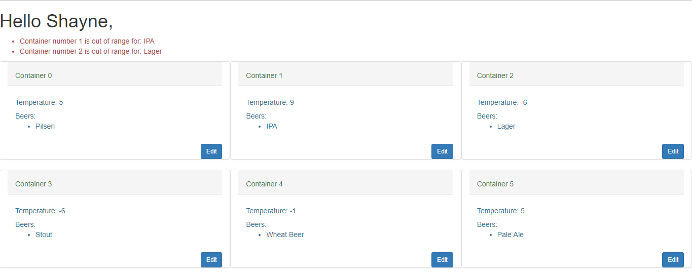

# pragmabrewery
PragmaBrewery Code Challenge

Technologies used in this Project:
1. Java
2. Spring Boot
3. Maven
4. Thymeleaf
5. JUnit
6. JavaScript

How to run using the maven plugin:
$ mvn spring-boot:run

and access http://localhost:8080/

What are the highlights of your logic/code writing style?
A. The highlights are TDD, Clean Code and simple code.

What could have been done in a better way? What would you do in version 2.0?
A. A page layout easier to understand, more beautiful and more clean. I would do in version 2.0 a page using ReactJS. 
Also, I would make the number of containers be able to be changed.

What were the questions you would ask and your own answers/assumptions?

Q. How many containers are there in Shane's truck?
A. For this project I fixed 6 containers in Shane's truck, initializing with one kind of beer in each container.

Q. How many beers are there in each container?
A. As I said before, each container starts with one kind of beer, but Shane can change it, choosing how many kind of beers he wants.

Q. How would be temperature input?
A. For this project, nothing about temperature input was told. My solution was generate a random temperature for each container. 
Those temperature change every 30 seconds (temperature vary between -7 and 10 degrees, so beers can be out of range above and below).

In page example below we can see 6 containers each one shows a list of beer and a temperature. 
There is a list of messages warning each container is out of range.

